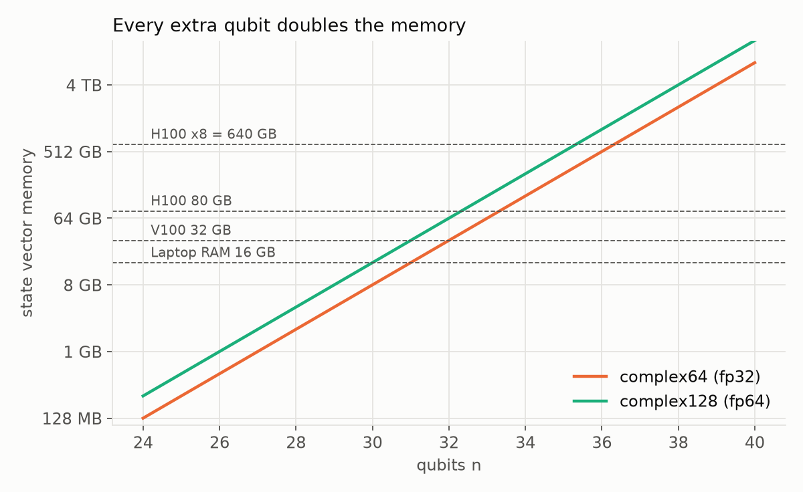

# さくらのGPUで量子コンピュータを「作る」：高火力DOK入門【量子シミュレーション第1回】

> **PR**：筆者はさくらインターネットの学生アンバサダーで、この記事の検証にはアンバサダーとして提供されたクーポンを利用しています。【TODO: アンバサダー規約の表記ルールに合わせて文言を確認】

量子コンピュータ、使ってみたいけど手元にない。実機のクラウドは順番待ちで、結果にもノイズが乗る。
それなら **GPU の上に量子コンピュータを丸ごと再現してしまおう**、というのがこのシリーズです。

使うのはさくらインターネットのコンテナ型 GPU クラウド **高火力 DOK**。NVIDIA H100 を秒単位課金で借りて、NVIDIA の量子シミュレーション SDK **CUDA-Q** を動かします。

**シリーズ構成**
1. **第1回（この記事）**：量子シミュレーションの仕組みと、高火力 DOK で動かすまで
2. 第2回：H100 で何量子ビットまで行ける？CPU vs GPU ベンチマーク
3. 第3回：量子化学を GPU で。VQE で分子のエネルギーを計算する

**こんな人向け**
- 量子コンピュータに興味はあるけれど、まだ触ったことがないエンジニア
- 研究で GPU が必要で、さくらの GPU を借りるとどうなるか知りたい人

コード一式は GitHub で公開しています：https://github.com/Klayertan/sakura-quantum

---

## 1. GPU で量子コンピュータが「作れる」理由

### 量子ビットは「確率の振幅」のリスト

古典ビットは 0 か 1 のどちらかです。量子ビットは 0 と 1 の**重ね合わせ**で、状態を2つの複素数（振幅）で表します。

```
|ψ⟩ = α|0⟩ + β|1⟩     （|α|² が 0 が出る確率、|β|² が 1 が出る確率）
```

量子ビットが n 個になると、`00…0` から `11…1` までの **2ⁿ 通りすべてに振幅が1つずつ**付きます。これを**状態ベクトル**と呼びます。

| 量子ビット数 | 振幅の数 |
|---|---|
| 2 | 4 |
| 10 | 1,024 |
| 30 | 約10.7億 |
| 40 | 約1.1兆 |

量子ゲート（量子コンピュータの命令）は、この巨大なベクトルに**行列を掛ける操作**です。つまり、量子コンピュータをシミュレーションするとは「巨大なベクトルに小さな行列を何度も掛ける」ことです。これはまさに **GPU が最も得意な仕事**です。

### 1量子ビット増えるごとにメモリは2倍

振幅1つは複素数なので、単精度（complex64）で 8 バイト、倍精度（complex128）で 16 バイト必要です。



| メモリ | 単精度で扱える量子ビット数 | 倍精度で扱える量子ビット数 |
|---|---|---|
| ノートPC 16GB | 30 | 29 |
| V100 32GB | 31 | 30 |
| **H100 80GB** | **33** | **32** |
| H100×8 = 640GB | 36 | 35 |

1量子ビット増やすたびに必要なメモリが倍になる。これが量子コンピュータのシミュレーションが難しい理由であり、同時に**本物の量子コンピュータが強い理由**でもあります。
（第2回では、この壁を「テンソルネットワーク」という別の手法ですり抜けて、100量子ビットに挑戦します。）

### CUDA-Q とは

[CUDA-Q](https://developer.nvidia.com/cuda-q) は NVIDIA のオープンソース量子プログラミング環境です。Python で量子回路を書き、**「ターゲット」を切り替えるだけで**同じコードを CPU でも GPU でも実行できます。

```python
import cudaq

@cudaq.kernel
def ghz(n: int):
    q = cudaq.qvector(n)       # n 量子ビットを用意
    h(q[0])                    # 1つ目を重ね合わせに
    for i in range(n - 1):
        x.ctrl(q[i], q[i + 1]) # CNOT で次々に「もつれ」させる
    mz(q)                      # 測定

cudaq.set_target("qpp-cpu")    # CPU で実行
print(cudaq.sample(ghz, 20))

cudaq.set_target("nvidia")     # GPU で実行（コードはそのまま）
print(cudaq.sample(ghz, 20))
```

この GHZ 状態は「全部 0」か「全部 1」しか出ない、量子もつれの代表例です。結果が `{ 000…0: 約500, 111…1: 約500 }` になれば、シミュレータが正しく動いています。

---

## 2. 高火力 DOK とは

[高火力 DOK](https://www.sakura.ad.jp/koukaryoku-dok/) は、**Docker イメージを渡すと GPU 上で実行してくれる**サービスです。サーバーの構築や SSH は不要で、使った秒数だけ課金されます。

| プラン | GPU | vCPU / メモリ | 料金（税込） |
|---|---|---|---|
| v100-32gb | V100 32GB | 3 / 40GB | ¥0.016/秒（¥57.6/時） |
| h100-80gb | H100 80GB | 10 / 192GB | ¥0.28/秒（¥1,008/時） |
| h100-8gpu-80gb | H100×8 | 160 / 1,760GB | ¥0.83/秒 |

※ 2026年9月時点。H100 プランは1タスクあたり最低60秒の課金。V100 プランは 2027年3月末で提供終了予定。

**初回は ¥3,000 分の無料クレジット**が付くので、この記事の内容は無料枠でも十分試せます。

研究用途で嬉しいポイント：
- **バッチ処理向き**：「スクリプトを投げて、結果ファイルを受け取る」だけ。消し忘れによる課金事故がない
- **秒課金**：数分で終わる実験を何度も回すのに向いている
- **国内リージョン**：データを国外に出せない研究でも使いやすい

---

## 3. 実験用コンテナを作る

### ファイル構成

```
sakura-quantum/
  Dockerfile
  requirements.txt      # cuda-quantum-cu12, cudaq-solvers-cu12, pyscf（バージョン固定）
  run.sh                # エントリポイント（smoke / bench / vqe / all）
  bench/scaling.py      # 第2回のベンチマーク
  vqe/vqe_molecules.py  # 第3回の量子化学計算
```

### Dockerfile

```dockerfile
FROM python:3.12-slim

RUN apt-get update && apt-get install -y --no-install-recommends procps libgfortran5 \
    && rm -rf /var/lib/apt/lists/*

COPY requirements.txt /app/requirements.txt
RUN pip install --no-cache-dir -r /app/requirements.txt

COPY run.sh /app/run.sh
COPY bench /app/bench
COPY vqe /app/vqe
RUN chmod +x /app/run.sh

WORKDIR /app
ENTRYPOINT ["/app/run.sh"]
CMD ["all"]
```

ポイントは、**CUDA 入りの重いベースイメージが不要**なことです。pip で CUDA-Q を入れると CUDA ランタイムも一緒に入り、GPU ドライバは DOK のホスト側から提供されます。

> **ハマりどころ①：`pip install cudaq` は使わない**
> 2026年9月時点で、`cudaq` パッケージは CUDA 13 版（`cuda-quantum-cu13` 0.16）を入れますが、化学計算用の `cudaq-solvers` 0.6.0 は CUDA 12 版（`cuda-quantum-cu12` 0.14）を要求します。両方を一緒に入れると **`import cudaq` できるモジュールが2つ同じ環境に入ってしまう**ので、`requirements.txt` では CUDA 12 版に揃えて固定しました。
>
> ```
> cuda-quantum-cu12==0.14.2
> cudaq-solvers-cu12==0.6.0
> pyscf==2.14.0
> ```
>
> **ハマりどころ②：`libgfortran5` が必要**
> `cudaq-solvers` は `libgfortran.so.5` を使いますが、wheel には含まれていません。slim イメージでは `import cudaq_solvers` が失敗するので、Dockerfile で `apt-get install libgfortran5` しています。

### 結果は `/opt/artifact` に書く

DOK では、タスク内で環境変数 `SAKURA_ARTIFACT_DIR`（= `/opt/artifact`）に保存したファイルを、終了後にコントロールパネルからダウンロードできます。`run.sh` では出力先をこの変数で決めています。

```bash
OUT="${SAKURA_ARTIFACT_DIR:-$PWD/results}"   # DOK 上なら /opt/artifact、ローカルなら ./results
```

---

## 4. まずはローカル（CPU）で動作確認

GPU の時間を無駄にしないよう、まず GPU なしの環境で小さく動かします。以下の出力は 4 コア・メモリ 16GB の Linux 環境（GPU なし）で取ったものです。Windows なら WSL（Ubuntu 24.04）で同じ手順が使えます。

```bash
python3 -m venv ~/cq
~/cq/bin/pip install -r requirements.txt
PATH=~/cq/bin:$PATH ./run.sh smoke
```

> **ハマりどころ**：Ubuntu 24.04 の WSL では `python3 -m venv` が `ensurepip is not available` で失敗することがあります。`sudo apt install python3.12-venv` を入れれば解決します。

実行結果：

```
=== job=smoke start 2026-09-24T17:02:19+00:00 ===
no nvidia-smi (CPU only)
cudaq CUDA-Q Version 0.14.2
qpp-cpu      ghz     n=  4      0.023s ok
qpp-cpu      ghz     n=  8     0.0202s ok
qpp-cpu      ghz     n= 12     0.0222s ok
qpp-cpu      ghz     n= 16     0.0865s ok
qpp-cpu      ghz     n= 20     1.8101s ok
qpp-cpu      qft     n=  4      0.024s ok
qpp-cpu      qft     n=  8     0.0347s ok
qpp-cpu      qft     n= 12      0.071s ok
qpp-cpu      qft     n= 16     0.6436s ok
qpp-cpu      qft     n= 20    17.7722s ok
qpp-cpu      random  n=  4     0.0399s ok
qpp-cpu      random  n=  8     0.0579s ok
qpp-cpu      random  n= 12     0.1489s ok
qpp-cpu      random  n= 16     2.1262s ok
qpp-cpu      random  n= 20     49.488s ok
[skip] target nvidia: Invalid simulator requested: cusvsim_fp32
qpp-cpu      H2    q= 4 params=  3 VQE=-1.137176 exact=-1.137176 err=4.86e-10 iters=44 7.781s
H2 d=0.300  HF=-0.593828 VQE=-0.601804 FCI=-0.601804
H2 d=1.400  HF=-0.941481 VQE=-1.015468 FCI=-1.015468
H2 d=2.500  HF=-0.702944 VQE=-0.936055 FCI=-0.936055
[skip] target nvidia-fp64: Invalid simulator requested: cusvsim_fp64
=== job=smoke end 2026-09-24T17:04:32+00:00 ===
```

確認できたこと：

- GHZ 回路の測定結果が「全部 0」と「全部 1」だけになっている（CSV の `check_ok` 列が `True`）
- H2 分子の VQE エネルギーが **-1.137176 Hartree** で、厳密解（FCI）との差は **5×10⁻¹⁰ Hartree**。化学的精度（1.6×10⁻³）を大きく下回ります
- 原子間距離 2.5Å まで引き伸ばすと、古典的な近似（Hartree-Fock）は厳密解から 0.23 Hartree もずれますが、VQE はぴったり一致
- GPU ターゲット（`nvidia`）は GPU がないので自動でスキップ

一方で CPU の限界もすでに見えています。**量子ビットを 16 → 20 に 4 つ増やしただけで、ランダム回路は 2.1 秒 → 49 秒（約 23 倍）**。これが次回 GPU で試す部分です。

> **ハマりどころ③：VQE の反復回数に上限を**
> 少し大きい LiH 分子（12 量子ビット・パラメータ 92 個）を CPU で試したところ、エネルギー評価 1 回に約 4 秒かかり、最適化（COBYLA）100 回でもまだ厳密解から 20 mHa ずれていました。既定の設定だと収束まで何時間もかかるので、課金される GPU で走らせる前に `--max-iterations` で上限を付けました。CPU と GPU の比較も「収束まで」ではなく「20 回あたりの時間」で測ります。

---

## 5. 高火力 DOK で実行する

### ① コンテナレジストリを作る

イメージの置き場所として、さくらのクラウドの「コンテナレジストリ」を作ります（月額 220 円、ストレージ 5GiB 込み）。コントロールパネルの「グローバル」→「コンテナレジストリ」→「追加」で、

- **名前**：表示用のラベル（例：`sakura-quantum`）
- **コンテナレジストリ名**：アドレスになる部分。`klayer` と入れると `klayer.sakuracr.jp` になります

作成後、「ユーザ」タブで push 用のユーザーを追加します。

【TODO: コンテナレジストリ作成画面のスクリーンショット】

> **ハマりどころ④：「名前」欄にアドレスを入れない**
> 最初、一番上の「名前」欄に `klayer.sakuracr.jp` と入れてしまいました。アドレスになるのは 2 つ目の「コンテナレジストリ名」の方で、`.sakuracr.jp` は自動で付きます。

### ② イメージのビルドは GitHub Actions に任せる

筆者のノート PC には Docker がありません。CUDA-Q 入りのイメージは数 GB あるので、手元でビルドするより **GitHub Actions でビルドしてレジストリに push** する方が楽です。リポジトリの `.github/workflows/image.yml` がそれで、

1. イメージをビルド
2. そのイメージで CPU のスモークテストを実行（通らなければ push しない）
3. さくらのコンテナレジストリに push

を自動で行います。リポジトリの「Settings → Secrets and variables → Actions」に次の 3 つを登録するだけです。

| Secret 名 | 値 |
|---|---|
| `SAKURA_REGISTRY` | `klayer.sakuracr.jp` |
| `SAKURA_REGISTRY_USER` | レジストリのユーザー名 |
| `SAKURA_REGISTRY_PASSWORD` | そのパスワード |

Docker がある環境なら、もちろん手元でも同じことができます。

```bash
docker build -t klayer.sakuracr.jp/sakura-quantum:latest .
docker login klayer.sakuracr.jp
docker push klayer.sakuracr.jp/sakura-quantum:latest
```

### ③ タスクを作成

コントロールパネルの「タスク」→「作成」で、以下を設定します。

| 項目 | 設定値 |
|---|---|
| イメージ | `klayer.sakuracr.jp/sakura-quantum:latest` |
| プラン | `h100-80gb`（V100 は使えません。下の「ハマりどころ」参照） |
| コマンド | `/app/run.sh smoke`（本番は `/app/run.sh all`）。smoke には GPU で LiH を 20 回だけ回す計測も入っているので、1 回あたりの秒数から本番の料金を見積もれます |
| レジストリ認証 | プライベートレジストリならユーザー名・パスワード |

【TODO: タスク作成画面のスクリーンショット】

> **ハマりどころ⑤：V100 では GPU シミュレータが動かない**
> 最初は安い V100（¥0.016/秒）で smoke を流しました。CPU の部分は動いたのに、GPU ターゲット（`nvidia`）に切り替えた瞬間に `Segmentation fault`。原因は、CUDA-Q が内部で使う NVIDIA cuStateVec が **v1.9 で Volta 世代（V100, compute capability 7.0）のサポートを終了**していたことでした。今の CUDA-Q を GPU で動かすなら H100 を選びましょう。
>
> **ハマりどころ⑥：新しい Debian だと化学ライブラリが読み込めない**
> 同じ実行で `ImportError: libcudaq-solvers.so: cannot enable executable stack` も出ました。`python:3.12-slim` のベースが Debian 13 に変わり、glibc 2.41 が「実行可能スタック」を要求するライブラリの読み込みを拒否するようになったためです。ベースイメージを `python:3.12-slim-bookworm`（Debian 12）に固定して解決しました。手元（Ubuntu 24.04, glibc 2.39）では再現しないので気付きにくい罠です。

### ④ 結果をダウンロード

タスクが完了すると、「アーティファクト」から `/opt/artifact` の中身を zip でダウンロードできます。`nvidia-smi.txt` に GPU の情報が、`log.txt` に実行ログが入っています。

```
【TODO: DOK 上での smoke 実行ログ（GPU 名、実行時間）】
```

かかった時間は【TODO】秒、料金は約【TODO】円でした。

---

## まとめ

- 量子コンピュータのシミュレーションは「2ⁿ 要素のベクトル × 行列」で、GPU の得意分野
- メモリは1量子ビットごとに2倍。H100 80GB なら約33量子ビットまで
- 高火力 DOK なら Docker イメージを渡すだけで H100 を秒単位で借りられる。無料クレジットで試せる

次回は、いよいよ H100 の本気を見ます。**CPU と GPU で何倍の差が出るのか、何量子ビットで限界が来るのか**を実測します。

---

**参考**
- [高火力 DOK（さくらインターネット）](https://www.sakura.ad.jp/koukaryoku-dok/)
- [NVIDIA CUDA-Q](https://developer.nvidia.com/cuda-q)
