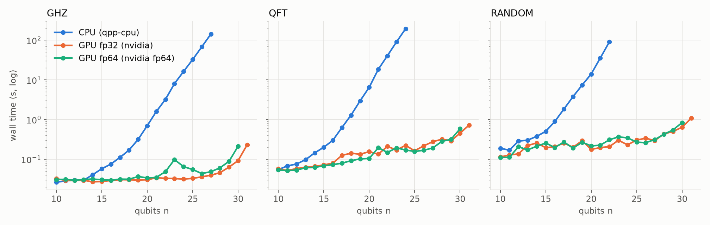
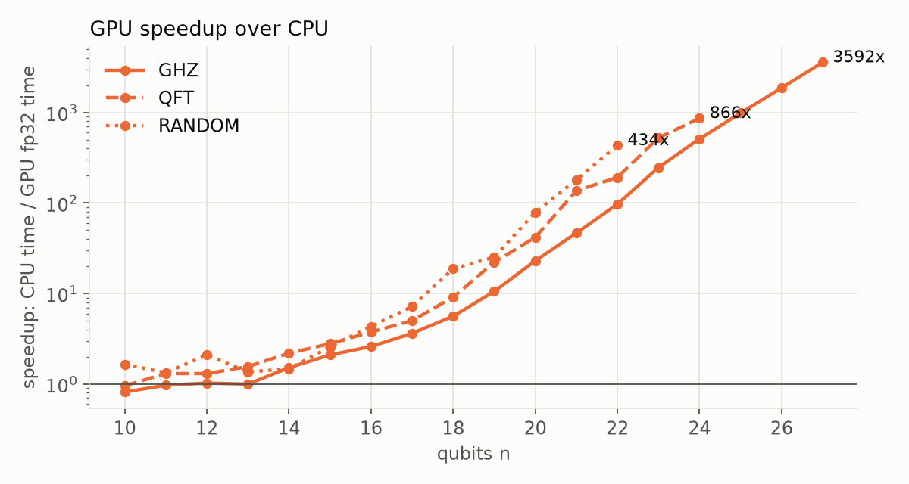

# H100 で何量子ビットまで行ける？CPU vs GPU ベンチマーク【量子シミュレーション第2回】

> **PR**：筆者はさくらインターネットの学生アンバサダーで、この記事の検証にはアンバサダーとして提供されたクーポンを利用しています。【TODO: アンバサダー規約の表記ルールに合わせて文言を確認】

[第1回](【TODO: 第1回の URL】)では、量子コンピュータのシミュレーションが「2ⁿ 要素のベクトル計算」であること、そして高火力 DOK に Docker イメージを渡せば H100 で動かせることを紹介しました。

今回はいよいよ本番です。**同じ量子回路を CPU と H100 で動かして、何倍速いのか、何量子ビットで限界が来るのか**を実測しました。

結論を先に書くと：

- **27 量子ビットの GHZ 回路で、CPU 142 秒 → H100 0.04 秒（約 3,600 倍）**
- H100 80GB で実際に動いたのは **fp32 で 31 量子ビット、fp64 で 30 量子ビットまで**（理論値より 2 量子ビット少ない。理由は後述）
- ベンチマーク全体で約 14 分、**料金は約 240 円**

コードとデータはすべて GitHub にあります：https://github.com/Klayertan/sakura-quantum

---

## 1. 何を測ったか

### 3 種類の回路

| 回路 | 中身 | 特徴 |
|---|---|---|
| **GHZ** | 全量子ビットをもつれさせる（H 1 個 + CNOT n−1 個） | ゲート数が少ない。「メモリを 1 回なめる速さ」を見る |
| **QFT** | 量子フーリエ変換（ゲート数 ≈ n²/2） | 量子アルゴリズムの定番部品。ゲート数が n² で増える |
| **random** | 回転ゲート＋CNOT を 10 層 | 「何でもない回路」。現実のワークロードに近い |

どれも 1,000 回測定（shots）して、測定結果が得られるまでの時間を測ります。GHZ は結果が「全部 0」か「全部 1」だけになるはずなので、答えのチェックにも使っています。

### 4 つの実行方法（CUDA-Q の「ターゲット」）

| ターゲット | 実行場所 | 精度 | 1 量子ビットあたりのメモリ |
|---|---|---|---|
| `qpp-cpu` | CPU（20 vCPU） | 倍精度 | 16 バイト × 2ⁿ |
| `nvidia` | H100 | 単精度（fp32） | 8 バイト × 2ⁿ |
| `nvidia` + `fp64` | H100 | 倍精度（fp64） | 16 バイト × 2ⁿ |

コードは `cudaq.set_target(...)` の 1 行を変えるだけで、回路の定義はまったく同じです。

### 実行環境

- 高火力 DOK `h100-80gb` プラン（NVIDIA H100 80GB HBM3、コンテナから見えるのは 20 vCPU / メモリ 216GB）
- CUDA-Q 0.14.2、ドライバ 580.173.02
- 1 回の実行が 90 秒を超えたら、その回路はそこで打ち切り

---

## 2. 結果：GPU は「横ばい」、CPU は「指数関数」



縦軸は対数です。**CPU（青）は 1 量子ビット増えるごとに約 2 倍ずつ遅くなり**、GHZ は 27 量子ビット、QFT は 24、random は 22 で 90 秒の壁に当たりました。

一方 **GPU（オレンジ・緑）は 25 量子ビットくらいまでほぼ横ばい**。20 量子ビット程度だと状態ベクトルはたった 8〜16MB で、H100 にとっては準備（カーネル起動や結果の転送）の時間の方が長いくらいです。30 量子ビットを超えたあたりでようやく右肩上がりになりますが、それでも **31 量子ビットで 1 秒前後**です。

### CPU の限界での比較

| 回路 | 量子ビット | CPU | H100 fp32 | 速さ | H100 fp64 | 速さ |
|---|---|---|---|---|---|---|
| GHZ | 27 | 141.9 秒 | 0.040 秒 | **約 3,600 倍** | 0.049 秒 | 約 2,900 倍 |
| QFT | 24 | 193.2 秒 | 0.223 秒 | **約 870 倍** | 0.171 秒 | 約 1,130 倍 |
| random | 22 | 90.1 秒 | 0.207 秒 | **約 430 倍** | 0.310 秒 | 約 290 倍 |



速度向上率は量子ビット数とともに指数的に伸びています。**小さい回路（10〜13 量子ビット）ではほぼ 1 倍、つまり GPU を使う意味がありません。** 差が 10 倍を超えるのは 18〜20 量子ビットあたりからです。

GHZ の倍率が一番大きいのは、ゲートが少ない分 GPU 側の時間が「ほぼ固定の準備時間」だけになるからです。逆に random のようにゲートが多い回路では GPU もしっかり計算するので、倍率は控えめになります（それでも 400 倍以上）。

### fp32 と fp64 はほぼ同じ速さ

意外だったのは、**倍精度（fp64）でも単精度（fp32）とほとんど速度が変わらない**ことです。H100 は倍精度演算も強いうえ、この規模では速度を決めているのは計算よりメモリの読み書きです。精度が必要な計算（第 3 回の量子化学など）では、迷わず fp64 を選んでよさそうです。

---

## 3. 何量子ビットまで行ける？「理論値 −2」の壁


第 1 回で書いた通り、状態ベクトルのメモリは 1 量子ビットごとに 2 倍になります。H100 の 80GB に入るのは、計算上は **fp32 で 33 量子ビット（64GB）、fp64 で 32 量子ビット（64GB）**です。

ところが実際に走らせると、1 回目のベンチマークでは

```
nvidia       ghz     n= 31     0.2415s ok
/app/run.sh: line 19:   156 Segmentation fault      (core dumped)
```

と、**fp32 は 32 量子ビット、fp64 は 31 量子ビットでプロセスごと落ちました。** どちらも状態ベクトルがちょうど **32GiB** になるサイズです。

`nvidia-smi` で確認すると GPU はちゃんと 80GB（81,559MiB）あり、分割（MIG）もされていません。つまり足りなかったのは状態ベクトルそのものではなく、**測定（サンプリング）のための作業領域**です。32GiB の状態に対して少なくとも 1.5 倍（48GiB）以上の追加メモリが必要になり、合計で 80GB を超えてしまったと考えられます（16GiB の状態は問題なく動きました）。

そこでベンチマークには「状態ベクトルが GPU メモリの 40% を超えるサイズは実行せず、スキップとして記録する」ガードを入れました。2 回目の実行ではすべての回路が最後まで走り、

| | 理論上の上限 | 実際に動いた上限 |
|---|---|---|
| fp32 | 33 量子ビット | **31 量子ビット** |
| fp64 | 32 量子ビット | **30 量子ビット** |

という結果になりました。**「メモリ ÷ 状態ベクトルのサイズ」で見積もった数から、2 量子ビット引いておく**のが実用的な目安です。

> **ハマりどころ：GPU のメモリ不足は「エラー」ではなく「クラッシュ」**
> CPU で同じことをすると Python の例外になりますが、GPU シミュレータではプロセスが `Segmentation fault` で即死しました。同じプロセスで次に予定していた回路も巻き添えで走らなかったので、**回路ごとに別プロセスで実行する**ように直しています。

---

## 4. かかった料金

| 実行 | プラン | 時間 | 料金（目安） |
|---|---|---|---|
| ベンチマーク 1 回目（クラッシュあり） | h100-80gb | 約 11 分 | 約 190 円 |
| ベンチマーク 2 回目（完走） | h100-80gb | 約 14 分 | 約 240 円 |

料金は ¥0.28/秒 × 実行時間で計算した目安です。【TODO: 請求情報の実際の金額を確認して差し替え】

**1 回 200 円ちょっとで、CPU なら何時間もかかる領域まで一気に測れる**のが DOK の強みです。今回 CPU は 90 秒で打ち切っていますが、CPU で 31 量子ビットの random 回路を走らせようとすると、1 量子ビット 2 倍のペースで単純に外挿して 90 秒 × 2⁹ ≈ 13 時間かかる計算になります。

---

## 5. 再現するには

```bash
# DOK のタスク作成画面で
イメージ:   <レジストリ>/sakura-quantum:latest
コマンド:   bench
プラン:     H100 (80GB)
最大実行時間: 3 時間（実際は 15 分程度）
```

結果（`scaling.csv`）をダウンロードしたら、グラフは次のコマンドで描けます。

```bash
python analysis/plot.py --results <展開したフォルダ> --out blog/images
```

今回の生データは [`blog/data/h100-bench-2026-09-25/`](https://github.com/Klayertan/sakura-quantum/tree/main/blog/data/h100-bench-2026-09-25) にあります。

---

## まとめ

- **20 量子ビットを超えると GPU の圧勝。** 27 量子ビットの GHZ で約 3,600 倍、QFT・random でも数百〜千倍
- **小さい回路では GPU の意味はない。** 10〜13 量子ビットでは CPU とほぼ同じ速さ
- **H100 80GB の実用上限は fp32 で 31、fp64 で 30 量子ビット。** 理論値から 2 引いて見積もる
- fp64 でも速度はほぼ落ちない
- 全部で 200 円台。DOK なら「気軽に 1 回測ってみる」ができる

次回は、この GPU を使って **量子化学（VQE）で分子のエネルギーを計算**します。ここで意外な結果が出ました：小さな分子では、GPU はあまり速くならなかったのです。

【TODO: 番外編】テンソルネットワーク（`tensornet`）を使えば浅い回路なら 100 量子ビット超も狙えるはずでしたが、今回の環境では `CUTENSORNET_STATUS_INVALID_VALUE` で起動直後に止まってしまいました。原因がわかったら追記します。

---

**参考**
- [高火力 DOK（さくらインターネット）](https://www.sakura.ad.jp/koukaryoku-dok/)
- [NVIDIA CUDA-Q](https://developer.nvidia.com/cuda-q)
- [cuStateVec](https://docs.nvidia.com/cuda/cuquantum/latest/custatevec/index.html)
